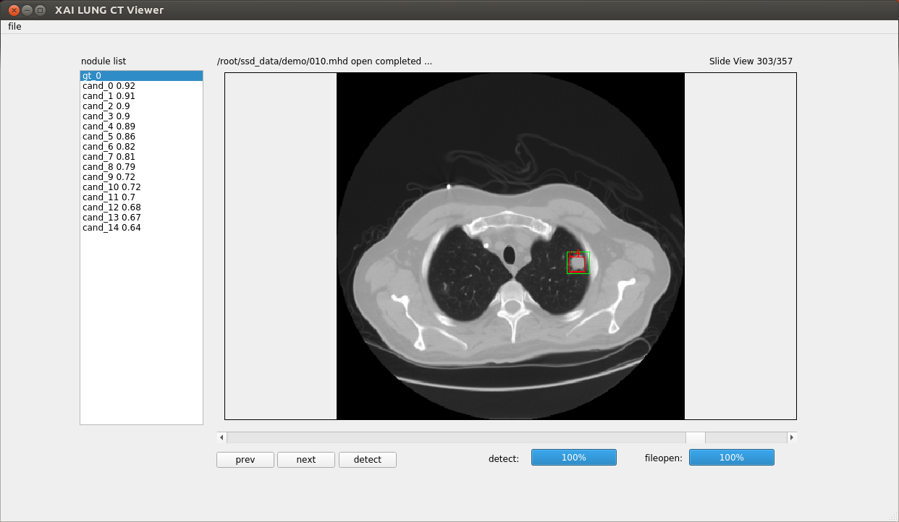
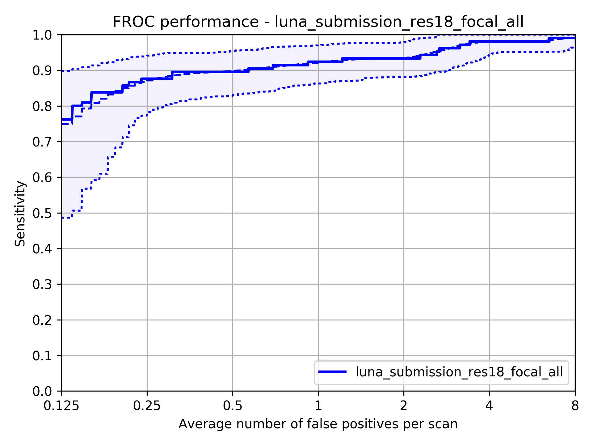

# lung_nodule_detector
lung nodule detector using 3d resnet

# Prerequisites
python 3.5.2      
pytorch 0.2.0
pyqt 5

# Docker Image
docker pull likebullet86/luna16_detector

# Using Viewer
 
- settings (detector_viewer/xai_viewer.py)
  - self.init_openpath
  - self.label_dirpath
  - self.detect_resume
  - self.gpu
- excute
  - python xai_viewer.py
- for using viewer in docker
  - xhost + (excute in host side)
  - excute docker with following options:
    -v "$HOME/.Xauthority:/root/.Xauthority:rw"
    -v /tmp/.X11-unix:/tmp/.X11-unix
    -e DISPLAY=$DISPLAY

# FROC curve
  
(0.74487168, 0.125)    
(0.87307787, 0.25)     
(0.89820999, 0.5)     
(0.92245173, 1.0)     
(0.93532807, 2.0)     
(0.98055845, 4.0)     
(0.99051809, 8.0)     
0.906431    

# Data Download
 - https://luna16.grand-challenge.org/download/
   - download data and candidates_V2.csv
 - https://wiki.cancerimagingarchive.net/display/Public/LIDC-IDRI
   - download Radiologist Annotations/Segmentations (XML)
   
# pretrained weight
 - https://drive.google.com/drive/u/1/folders/15d8BsRLNkroAl0iypHaIrlRorhBImzYk
 - download detector.ckpt
 
# Training
 - set luna and lidc path: set config_training.py
 - export path: source export_path.sh
 - train, val idx npy make: python preprocess/make_validate_npy.py
 - preprocess data make: python preprocess/prepare.py
 - train: sh train.sh
 
# Make froc curve
 - make test result bbox: sh test.sh
 - make froc sumbit: python make_FROC_submit_native.py
 - calc froc curve: sh eval.sh

# Todo
 - apply UNET base lung segment
 
# Reference Code
https://github.com/lfz/DSB2017    
https://github.com/juliandewit/kaggle_ndsb2017  
